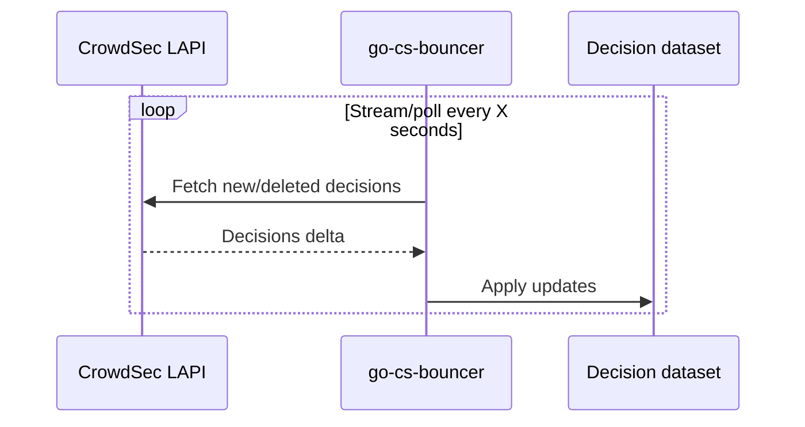
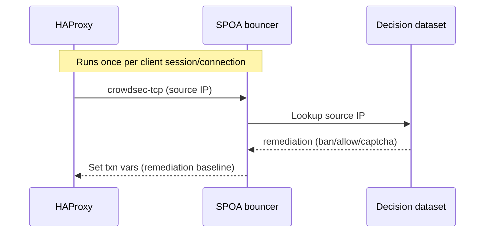
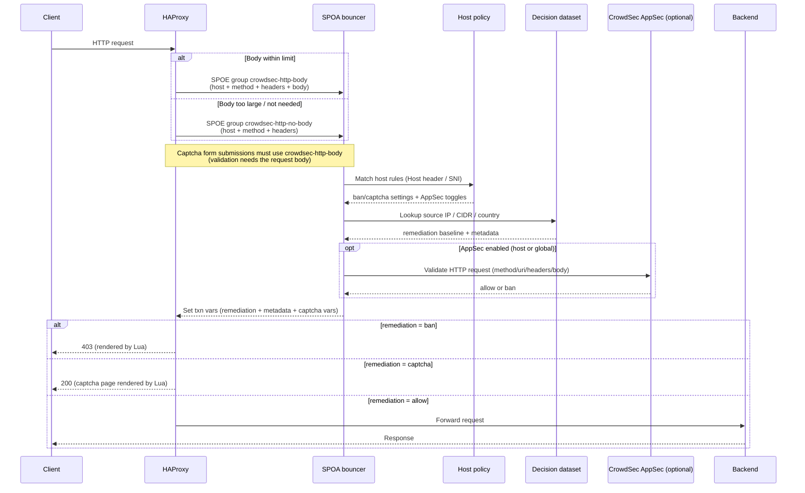
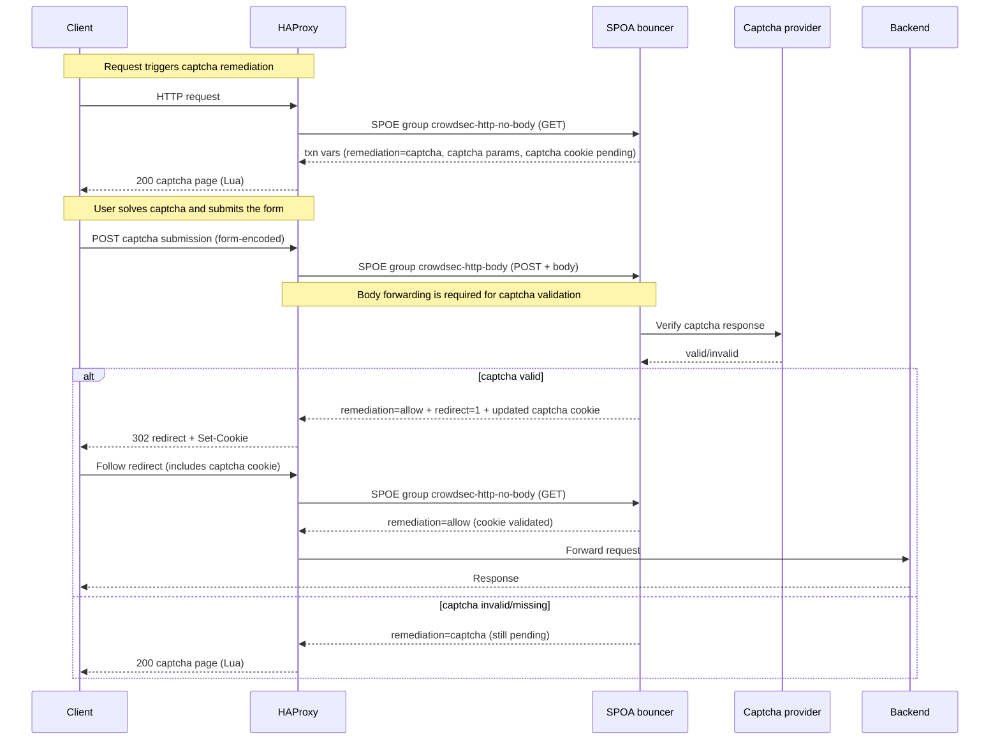
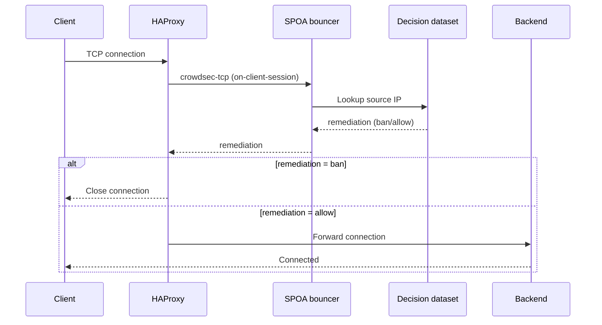
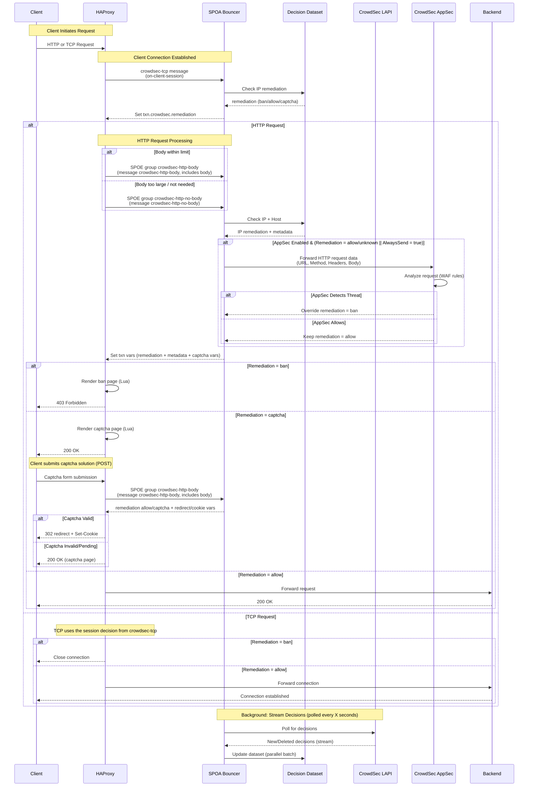

# Architecture

This document describes how the bouncer works under the hood and how HAProxy interacts with it via SPOE.

## Components

The bouncer is a single binary with three key loops:

1. `go-cs-bouncer` maintains a long-lived stream to the CrowdSec Local API and feeds new/deleted decisions into the dataset (`pkg/dataset`).
2. The SPOA worker (`pkg/spoa`) listens on TCP and/or Unix sockets, answers HAProxy messages, and applies host-specific logic such as captchas or ban pages.
3. Auxiliary services (optional) expose Prometheus metrics and pprof diagnostics.

## Request Flow (Detailed)

These diagrams focus on what you configure and observe in HAProxy: when SPOE messages are sent, what the bouncer returns, and where HAProxy takes action (render a page, set cookies, forward upstream).

**Legend**
- **SPOE message**: a request from HAProxy to the SPOA bouncer (for example `crowdsec-tcp` or `crowdsec-http-body`).
- **SPOE group**: what HAProxy sends from the frontend via `http-request send-spoe-group ...`; a group can contain one or more SPOE messages.
- **Remediation**: the decision HAProxy enforces (`allow`, `captcha`, `ban`).
- **Transaction variables**: values the bouncer sets on the HAProxy transaction (for example `txn.crowdsec.remediation`) for ACLs, headers, Lua templates, redirects, and cookie management.

### 1) Background: decisions sync (continuous)

### 2) Connection start: `crowdsec-tcp` (always)

### 3) HTTP request: `crowdsec-http-body` / `crowdsec-http-no-body` (per request)

### 4) Captcha lifecycle (challenge → submit → cookie → redirect)

### 5) TCP enforcement: `crowdsec-tcp` (session-level)

**Notes**
- `crowdsec-tcp` runs first so every connection carries an initial decision, even if HTTP parsing fails later.
- Host rules can override remediations (for example, force captcha on specific domains) and decide whether captcha cookies should be issued/cleared.
- Captcha state is stateless and carried in a signed token cookie; HAProxy can set/clear it using transaction variables, while Lua focuses on rendering pages.
- Captcha validation requires the form body; ensure captcha POSTs are sent via the `crowdsec-http-body` SPOE group.
- AppSec validation is optional; when enabled, HTTP requests can be forwarded to CrowdSec AppSec and the result can override the remediation.

## Full End-to-End Sequence (Reference)

## Examples

For complete, working examples (including request-body forwarding, captcha redirects, and cookie management), see:
- `config/haproxy.cfg`
- `config/crowdsec.cfg`

