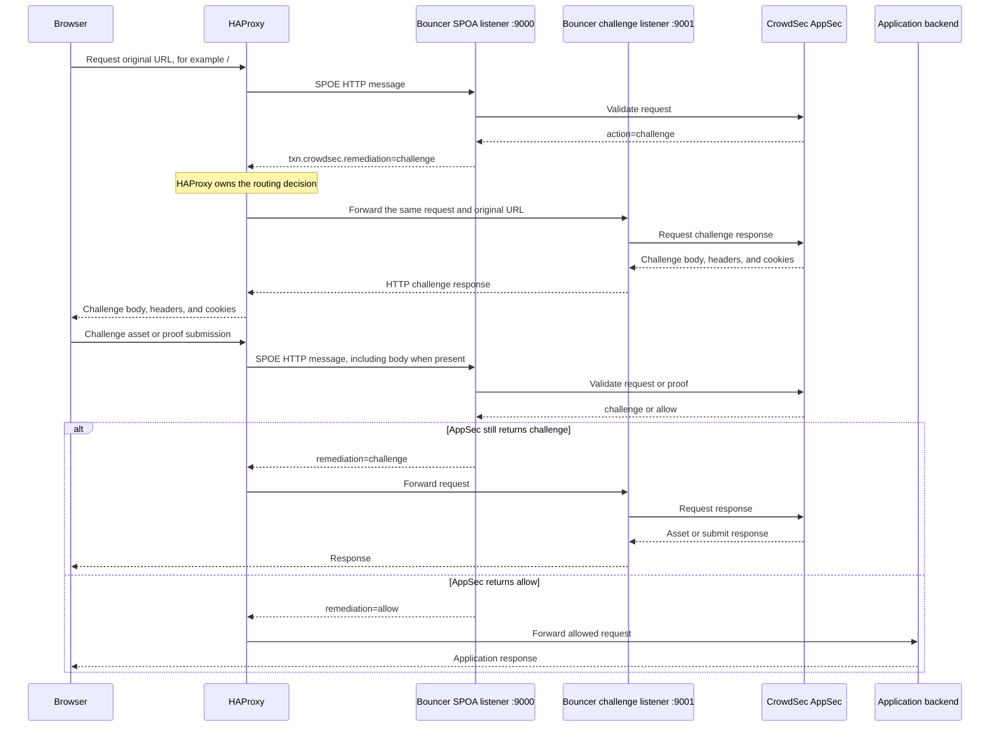

# AppSec Challenge Workflow

This document explains how an AppSec browser challenge travels through HAProxy
and the SPOA bouncer, and which component is responsible for each part of the
flow.

The challenge is served on the original requested URL, including `/`. A public
`/challenge` endpoint is not required.

## Responsibility Summary

| Component | Responsibilities |
| --- | --- |
| HAProxy | Receives the browser request, sends request data to the SPOA bouncer, reads the returned remediation, and routes `challenge` requests to the bouncer challenge HTTP listener. |
| SPOA bouncer listener | Evaluates CrowdSec decisions and host policy, calls AppSec, and sets `txn.crowdsec.remediation=challenge` when AppSec requests a challenge. |
| Bouncer challenge HTTP listener | Receives requests routed by HAProxy, calls AppSec again, and returns AppSec's challenge body, headers, and cookies to the browser. |
| CrowdSec AppSec | Decides whether a request is allowed, banned, or challenged. It generates the challenge page, assets, submit responses, and challenge cookies. |
| Application backend | Receives the request only when the final remediation is `allow`. |

HAProxy owns request routing. The bouncer cannot route the browser connection
from its SPOE listener because SPOE only returns actions and transaction
variables to HAProxy.

The bouncer owns both the CrowdSec decision logic and the internal HTTP listener
that serves AppSec challenge responses.

## Listeners

The bouncer exposes two different listeners:

```text
:9000  SPOA listener
:9001  Challenge HTTP listener
```

- The SPOA listener on `:9000` communicates with HAProxy through the SPOE
  protocol. It returns the remediation decision, but not the challenge HTML.
- The challenge listener on `:9001` communicates through normal HTTP. HAProxy
  routes challenged browser requests to it so large HTML, JavaScript, JSON, and
  cookies do not pass through SPOE.

The challenge listener should only be reachable by HAProxy.

## Remediation Value

The bouncer defines `challenge` as a dedicated remediation. Its ordering is:

```text
allow < unknown < captcha < challenge < ban
```

This makes `challenge` more restrictive than captcha and less restrictive than
ban when the bouncer selects the most restrictive remediation.

## End-to-End Workflow



## Phase 1: Decide Through SPOE

HAProxy sends each HTTP request to the SPOA bouncer:

```haproxy
http-request send-spoe-group crowdsec crowdsec-http-body if body_within_limit || !{ req.body_size -m found }
http-request send-spoe-group crowdsec crowdsec-http-no-body if !body_within_limit { req.body_size -m found }
```

The SPOA bouncer:

1. Checks the current CrowdSec IP decision.
2. Applies host-specific policy.
3. Calls AppSec when AppSec validation is enabled.
4. Selects the most restrictive remediation.
5. Sets the HAProxy transaction remediation.

When AppSec requests a browser challenge, the bouncer returns:

```text
txn.crowdsec.remediation = challenge
```

The challenge body is intentionally not returned through SPOE because it can be
larger than a SPOE frame.

The first AppSec call is only used to decide the remediation. Even when AppSec
returns challenge content with that decision, the content is not sent back
through SPOE.

## Phase 2: Route And Serve The Challenge

After receiving `remediation=challenge`, HAProxy:

1. Adds the trusted real-client-IP header.
2. Routes the original request to the challenge backend.
3. Does not invoke the Lua ban/captcha renderer.

```haproxy
http-request set-header X-Crowdsec-Real-Ip %[src] if { var(txn.crowdsec.remediation) -m str "challenge" }

http-request lua.crowdsec_handle if { var(txn.crowdsec.remediation) -m str "captcha" }
http-request lua.crowdsec_handle if { var(txn.crowdsec.remediation) -m str "ban" }

use_backend crowdsec-challenge if { var(txn.crowdsec.remediation) -m str "challenge" }
use_backend app

backend crowdsec-challenge
    mode http
    server challenge 127.0.0.1:9001
```

This rule is based on the remediation, not the request path. If AppSec challenges
`/`, HAProxy forwards `/` to the challenge listener. Challenge assets and proof
submissions follow the same routing process.

The bouncer challenge HTTP listener then:

1. Reads the client IP from `X-Crowdsec-Real-Ip`.
2. Falls back to the connection's `RemoteAddr` when the header is absent.
3. Reads the request body with a 10 MB limit.
4. Clones the original request headers.
5. Removes `X-Crowdsec-Real-Ip` and `X-Forwarded-For`.
6. Reconstructs the AppSec request using the original host, method, URL,
   headers, body, user agent, and client IP.
7. Calls AppSec.
8. Writes AppSec's status, body, selected headers, and `Set-Cookie` values back
   to HAProxy.

HAProxy returns that response to the browser.

If AppSec returns `allow` during this second call, the challenge listener
returns HTTP `200` with an empty body. The next browser request, carrying the
solved challenge cookie, follows the normal SPOE decision flow and can be routed
to the application backend.

## AppSec Challenge Response

When AppSec decides to challenge a request, it returns HTTP `403` to the bouncer
with a JSON envelope:

```json
{
  "action": "challenge",
  "http_status": 200,
  "user_body_content": "<!DOCTYPE html>...",
  "user_headers": {
    "Content-Type": ["text/html"],
    "Content-Security-Policy": ["default-src 'self'"],
    "Cache-Control": ["no-cache, no-store"]
  },
  "user_cookies": [
    "__crowdsec_challenge=...; HttpOnly; Path=/; SameSite=Lax"
  ]
}
```

The bouncer interprets the fields as follows:

- `action` must be `challenge`; any other `403` action is treated as `ban`.
- `http_status` is returned to the browser. The challenge listener defaults to
  `200` when it is absent or invalid.
- `user_body_content` contains the HTML, JavaScript, or JSON response body.
- `user_headers` contains selected response headers forwarded to the browser.
- `user_cookies` contains individual `Set-Cookie` values forwarded to the
  browser.

An empty or invalid JSON body on an AppSec `403` response defaults to `ban`.

## Configuration

Enable AppSec and the challenge HTTP listener in the bouncer configuration:

```yaml
appsec_url: http://127.0.0.1:7422/
appsec_timeout: 200ms
challenge_listen: 127.0.0.1:9001
```

When HAProxy and the bouncer run in different containers or hosts, bind the
challenge listener to a trusted private interface and point the HAProxy
`crowdsec-challenge` backend to that address.

## Challenge Assets, Proof Submission, And Cookies

AppSec may instruct the browser to request challenge assets or submit proof
data, for example:

```text
/crowdsec-internal/challenge/pow-worker.js
/crowdsec-internal/challenge/submit
```

HAProxy must continue sending these requests through SPOE. Proof submissions
usually contain a request body, so the body-capable SPOE group must be used when
the body is within the configured limit.

AppSec owns challenge cookies and validates solved challenge state. The bouncer
does not interpret these cookies; its challenge listener forwards AppSec's
`Set-Cookie` values to the browser.

Solved state is visible to AppSec on subsequent requests through the browser's
normal `Cookie` header. When AppSec recognizes a valid challenge cookie, it can
return `allow`.

## Failure Behavior

During SPOE validation, AppSec responses are interpreted as follows:

| AppSec response | Bouncer result |
| --- | --- |
| HTTP `200` | `allow` |
| HTTP `403` with `action=challenge` | `challenge` |
| HTTP `403` with another action | `ban` |
| HTTP `403` with an empty or invalid body | `ban` |
| HTTP `401`, `500`, or another unexpected status | Keep the existing remediation and log an error |

If the AppSec call made by the challenge HTTP listener fails, the listener
returns HTTP `500`. If AppSec returns `allow` during challenge handling, the
listener returns HTTP `200` with an empty body.

## Security Requirements

- Do not expose the challenge HTTP listener directly to the internet.
- Only trust `X-Crowdsec-Real-Ip` when it is added by HAProxy.
- Bind AppSec and both bouncer listeners to loopback or trusted private
  interfaces.
- Do not send `challenge` remediation through the Lua ban/captcha renderer.
- Keep challenge response bodies out of SPOE.
- Preserve repeated `Set-Cookie` headers individually.
