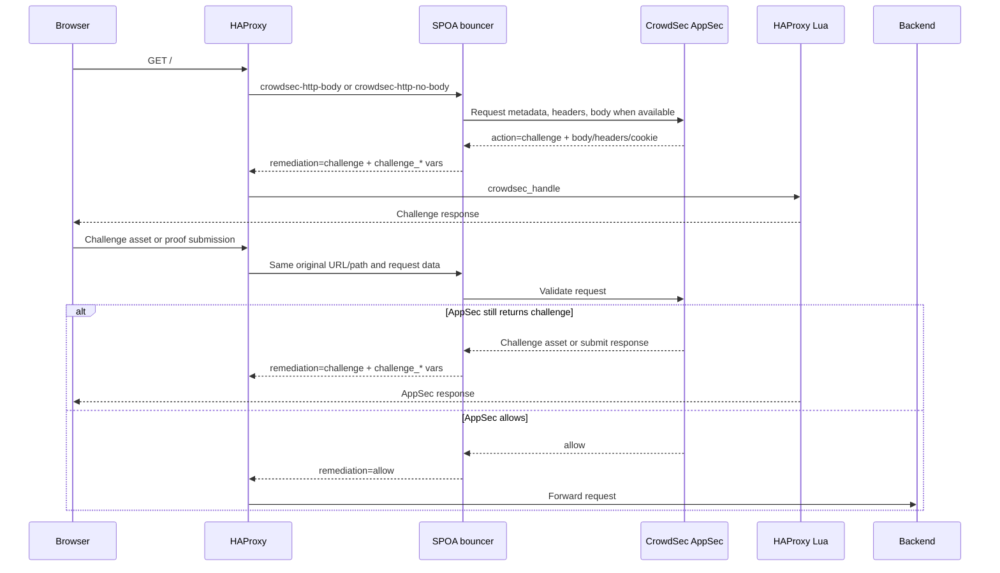

# AppSec Challenge Workflow

This document explains how an AppSec browser challenge travels through HAProxy
and the SPOA bouncer.

The challenge is served on the original requested URL, including `/`. A public
`/challenge` endpoint is not required, and the bouncer does not expose a
separate challenge HTTP listener.

## Components

| Component | Role |
|---|---|
| HAProxy | Receives the browser request, sends request data to the SPOA bouncer, reads returned transaction variables, and calls Lua for challenge responses. |
| SPOA bouncer | Evaluates CrowdSec decisions and host policy, calls AppSec, and returns remediation plus challenge response data through SPOE variables. |
| HAProxy Lua handler | Writes the challenge body, status, headers, and cookie returned by the bouncer to the browser. |
| CrowdSec AppSec | Decides whether a request is allowed, banned, or challenged. It generates the challenge page, assets, submit responses, and challenge cookies. |

The bouncer runs one SPOA listener. Challenge content is returned over SPOE; this
assumes the configured HAProxy/SPOE frame size is large enough for the AppSec
challenge responses used in the deployment.

## Remediation Ordering

The bouncer defines `challenge` as a dedicated remediation. Its ordering is:

```text
allow < unknown < captcha < challenge < ban
```

This makes `challenge` more restrictive than captcha and less restrictive than
ban. AppSec may therefore upgrade an allowed request to `challenge`, but a
dataset ban still wins over an AppSec challenge.

## Request Flow


```mermaid
sequenceDiagram
    participant Browser
    participant HAProxy
    participant SPOA as SPOA bouncer
    participant AppSec as CrowdSec AppSec
    participant Lua as HAProxy Lua

    Browser->>HAProxy: GET /
    HAProxy->>SPOA: crowdsec-http-body or crowdsec-http-no-body
    SPOA->>AppSec: Request metadata, headers, body when available
    AppSec-->>SPOA: action=challenge + body/headers/cookie
    SPOA-->>HAProxy: remediation=challenge + challenge_* vars
    HAProxy->>Lua: crowdsec_handle
    Lua-->>Browser: Challenge response

    Browser->>HAProxy: Challenge asset or proof submission
    HAProxy->>SPOA: Same original URL/path and request data
    SPOA->>AppSec: Validate request

    alt AppSec still returns challenge
        AppSec-->>SPOA: Challenge asset or submit response
        SPOA-->>HAProxy: remediation=challenge + challenge_* vars
        Lua-->>Browser: AppSec response
    else AppSec allows
        AppSec-->>SPOA: allow
        SPOA-->>HAProxy: remediation=allow
        HAProxy->>Backend: Forward request
    end
```

## HAProxy Wiring

The HTTP SPOE groups must send enough request data for AppSec to make a decision:

```haproxy
http-request send-spoe-group crowdsec crowdsec-http-body if body_within_limit || !{ req.body_size -m found }
http-request send-spoe-group crowdsec crowdsec-http-no-body if !body_within_limit { req.body_size -m found }
```

When AppSec returns `challenge`, the bouncer sets transaction variables and
HAProxy calls the Lua response handler:

```haproxy
http-request lua.crowdsec_handle if { var(txn.crowdsec.remediation) -m str "challenge" }
http-request lua.crowdsec_handle if { var(txn.crowdsec.remediation) -m str "captcha" }
http-request lua.crowdsec_handle if { var(txn.crowdsec.remediation) -m str "ban" }
```

The Lua handler uses these transaction variables for challenge responses:

| Variable | Meaning |
|---|---|
| `txn.crowdsec.challenge_status` | HTTP status returned to the browser. Defaults to `200` if missing. |
| `txn.crowdsec.challenge_body` | AppSec response body. |
| `txn.crowdsec.challenge_content_type` | Optional `Content-Type` header. |
| `txn.crowdsec.challenge_csp` | Optional `Content-Security-Policy` header. |
| `txn.crowdsec.challenge_cache_control` | Optional `Cache-Control` header. |
| `txn.crowdsec.challenge_cookie` | Optional `Set-Cookie` header. |

## AppSec Challenge Response

When AppSec decides to challenge a request, it returns HTTP `403` to the bouncer
with a JSON body similar to:

```json
{
  "action": "challenge",
  "http_status": 200,
  "user_body_content": "<html>...</html>",
  "user_headers": {
    "Content-Type": ["text/html"],
    "Content-Security-Policy": ["default-src 'self'"],
    "Cache-Control": ["no-store"]
  },
  "user_cookies": [
    "__crowdsec_challenge=...; HttpOnly; Path=/; SameSite=Lax"
  ]
}
```

Rules:

- `action` must be `challenge`; any other `403` action is treated as `ban`.
- `http_status` is returned to the browser, defaulting to `200` if omitted.
- `user_body_content` becomes `txn.crowdsec.challenge_body`.
- Selected `user_headers` are forwarded through challenge transaction variables.
- The first `user_cookies` value is forwarded as `Set-Cookie`.

## Configuration

Enable AppSec in the bouncer configuration:

```yaml
appsec_url: http://127.0.0.1:7422/
appsec_timeout: 200ms
```

No `challenge_listen` setting is required.

## Notes

- Captcha remediation remains separate from AppSec challenge remediation.
- Challenge assets and proof submissions are ordinary requests inspected by the same SPOE flow.
- If AppSec validation fails, the bouncer keeps the previous remediation.
- Frame size must be configured high enough for the largest challenge response sent through SPOE.
