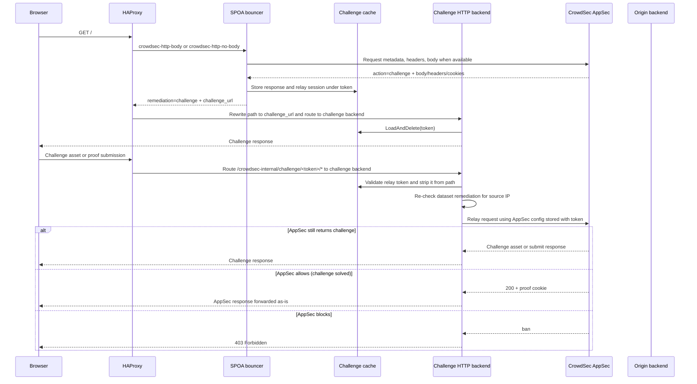

# AppSec Challenge Workflow

This document explains how an AppSec browser challenge travels through HAProxy
and the SPOA bouncer.

Challenges are served on the original requested URL. HAProxy rewrites the path
to an internal tokenized URL returned by the bouncer, then streams the challenge
response from the bouncer's HTTP challenge backend.

## Components

| Component | Role |
|---|---|
| HAProxy | Receives the browser request, sends request data to the SPOA bouncer, reads returned transaction variables, and routes challenge traffic to the challenge HTTP backend. |
| SPOA bouncer | Evaluates CrowdSec decisions and host policy, calls AppSec, stores AppSec challenge responses briefly, and returns `remediation=challenge` plus `challenge_url` through SPOE. |
| Challenge HTTP backend | A bouncer HTTP listener configured with `challenge_http_listen`; serves cached challenge pages and relays AppSec challenge asset/proof traffic. |
| CrowdSec AppSec | Decides whether a request is allowed, banned, or challenged. It generates the challenge page, assets, submit responses, headers, and cookies. |

## Remediation Ordering

The bouncer defines `challenge` as a dedicated remediation. Its ordering is:

```text
allow < unknown < captcha < challenge < ban
```

`challenge` is more restrictive than captcha and less restrictive than ban.
Only AppSec-issued challenges can be served as browser challenges. A dataset or
LAPI decision with type `challenge` does not include the AppSec-generated body,
headers, cookies, or `challenge_url`, so the bouncer fails it closed to `ban`.

## Request Flow


```mermaid
sequenceDiagram
    participant Browser
    participant HAProxy
    participant SPOA as SPOA bouncer
    participant Cache as Challenge cache
    participant HTTP as Challenge HTTP backend
    participant AppSec as CrowdSec AppSec
    participant Backend as Origin backend

    Browser->>HAProxy: GET /
    HAProxy->>SPOA: crowdsec-http-body or crowdsec-http-no-body
    SPOA->>AppSec: Request metadata, headers, body when available
    AppSec-->>SPOA: action=challenge + body/headers/cookies
    SPOA->>Cache: Store response and relay session under token
    SPOA-->>HAProxy: remediation=challenge + challenge_url
    HAProxy->>HTTP: Rewrite path to challenge_url and route to challenge backend
    HTTP->>Cache: LoadAndDelete(token)
    HTTP-->>Browser: Challenge response

    Browser->>HAProxy: Challenge asset or proof submission
    HAProxy->>HTTP: Route /crowdsec-internal/challenge/<token>/* to challenge backend
    HTTP->>Cache: Validate relay token and strip it from path
    HTTP->>HTTP: Re-check dataset remediation for source IP
    HTTP->>AppSec: Relay request using AppSec config stored with token

    alt AppSec still returns challenge
        AppSec-->>HTTP: Challenge asset or submit response
        HTTP-->>Browser: Challenge response
    else AppSec allows (challenge solved)
        AppSec-->>HTTP: 200 + proof cookie
        HTTP-->>Browser: AppSec response forwarded as-is
    else AppSec blocks
        AppSec-->>HTTP: ban
        HTTP-->>Browser: 403 Forbidden
    end
```

## HAProxy Wiring

HAProxy must send HTTP request data to the SPOE agent for ordinary traffic, but
skip SPOE for challenge backend paths so follow-up challenge traffic does not
mint a new top-level challenge:

```haproxy
acl crowdsec_challenge_backend_path path_beg /crowdsec-challenge/ /crowdsec-internal/challenge/

http-request send-spoe-group crowdsec crowdsec-http-body if !crowdsec_challenge_backend_path body_within_limit || !crowdsec_challenge_backend_path !{ req.body_size -m found }
http-request send-spoe-group crowdsec crowdsec-http-no-body if !crowdsec_challenge_backend_path !body_within_limit { req.body_size -m found }
```

When AppSec returns `challenge`, the bouncer sets `txn.crowdsec.challenge_url`.
HAProxy rewrites the request path to that URL and routes it to the challenge
backend:

```haproxy
acl is_challenge var(txn.crowdsec.remediation) -m str "challenge"
http-request set-path %[var(txn.crowdsec.challenge_url)] if is_challenge { var(txn.crowdsec.challenge_url) -m found }

use_backend crowdsec-challenge if is_challenge { var(txn.crowdsec.challenge_url) -m found }
use_backend crowdsec-challenge if crowdsec_challenge_backend_path
```

The internal challenge relay must receive a trusted source IP from HAProxy.
Overwrite the header rather than trusting client-supplied forwarding headers:

```haproxy
http-request set-header X-Crowdsec-Real-Src %[src] if crowdsec_challenge_backend_path
```

The challenge backend points at the bouncer's `challenge_http_listen` address:

```haproxy
backend crowdsec-challenge
    mode http
    option forwardfor
    timeout connect 2s
    timeout server 60s
    # Challenge responses are stored in the bouncer process that handled SPOE.
    # Keep this backend pinned to that same instance; do not load-balance it
    # independently unless challenge storage is shared.
    server s3 spoa:9100
```

## Bouncer Behavior

For the initial challenged request:

- AppSec returns HTTP `403` with JSON challenge data.
- The bouncer stores the full challenge response in an in-memory bounded cache.
- The bouncer rewrites challenge-internal URLs in the response body so
  `/crowdsec-internal/challenge/*` becomes
  `/crowdsec-internal/challenge/<token>/*`.
- The bouncer stores a short-lived relay session under the same token.
- The bouncer returns only `remediation=challenge` and `challenge_url` through SPOE.
- HAProxy routes the same client request to `/crowdsec-challenge/<token>`.
- The challenge HTTP backend serves the cached response once and deletes it.

For `/crowdsec-internal/challenge/<token>/*` follow-up traffic:

- HAProxy routes directly to the challenge HTTP backend and skips SPOE.
- The bouncer requires a live relay token issued with an AppSec challenge. A
  missing, malformed, unknown, or expired token returns `404` without calling
  AppSec.
- The bouncer strips `<token>` before relaying, so AppSec still receives its
  expected `/crowdsec-internal/challenge/*` path.
- The bouncer takes the source IP from `X-Crowdsec-Real-Src` and nothing else. If
  the header is missing or unparseable the request is refused with `403` — there is
  no `RemoteAddr` fallback, because `RemoteAddr` here is HAProxy rather than the
  visitor. Besides skipping the ban check, guessing would send the proxy's address
  to AppSec as `X-Crowdsec-Appsec-Ip`, which AppSec uses as `ClientIP` for Coraza,
  allowlist lookups, country rules and the `client_ip` on every event it emits —
  silently attributing all challenge traffic to your own infrastructure. A missing
  header means the HAProxy config above was not applied; the bouncer logs that once
  and rejects.
- The bouncer re-checks dataset remediation and rejects `challenge` and `ban`
  decisions before relaying to AppSec. A `captcha` decision is *not* rejected: the
  same IP can hold a captcha decision and an AppSec challenge at once, and 403ing
  the challenge assets would leave that user with nothing to solve.
- The bouncer uses the AppSec configuration stored with the relay token, not the
  client-controlled `Host` on the follow-up request.
- When AppSec still returns `challenge`, the bouncer unwraps the JSON envelope and
  serves the challenge content.
- When AppSec allows the request - which for a proof submission means the challenge
  was solved - the bouncer forwards AppSec's own response unchanged: status, body
  and every `Set-Cookie`. The proof cookie rides back on that response and is what
  the browser replays on its retry, so it must not be dropped. The response is
  forwarded as-is; Go's HTTP client already consumes `Connection` and
  `Transfer-Encoding` before the bouncer sees them, and the `Content-Length` that
  reaches it always matches the body it read.
- When AppSec blocks the request, the bouncer returns a plain `403` rather than
  leaking AppSec's JSON decision envelope to the browser.

## AppSec Challenge Response

When AppSec decides to challenge a request, it returns HTTP `403` to the bouncer
with a JSON body similar to:

```json
{
  "action": "challenge",
  "http_status": 200,
  "user_body_content": "<html>...</html>",
  "user_headers": {
    "Content-Type": ["text/html"],
    "Content-Security-Policy": ["default-src 'self'"],
    "Cache-Control": ["no-store"]
  },
  "user_cookies": [
    "__crowdsec_challenge=...; HttpOnly; Path=/; SameSite=Lax"
  ]
}
```

Rules:

- `action` must be `challenge`; any other `403` action is treated as `ban`.
- `http_status` is returned to the browser, defaulting to `200` if omitted.
- `user_body_content` is served by the challenge HTTP backend.
- `user_headers` are forwarded to the browser response.
- Every `user_cookies` value is forwarded as `Set-Cookie`.
- If the body is empty, the bouncer treats the challenge as malformed and fails closed to `ban`.

## Configuration

Enable the challenge HTTP backend and AppSec in the bouncer configuration:

```yaml
listen_tcp: 0.0.0.0:9000
challenge_http_listen: 127.0.0.1:9100

appsec_url: http://127.0.0.1:7422/
appsec_timeout: 200ms
```

Use `0.0.0.0:9100` for `challenge_http_listen` when HAProxy and the bouncer run
in different containers or network namespaces.

The pending challenge cache is bounded and short-lived:

```yaml
#challenge_cache_max_entries: 1000
```

When unset or non-positive, the cache defaults to 1000 entries. Entries are
valid for 30 seconds and are single-use. At capacity, the cache evicts the
least-recently-used pending challenge response.

## High Availability Constraint

Challenge response storage is local to each bouncer process. The initial SPOE
request stores the challenge page in that process, and the follow-up HTTP fetch
must reach the same process to read it. If HAProxy sends SPOE to one bouncer
replica and routes `backend crowdsec-challenge` to another, the second replica
does not have the cached response and the browser receives `404`.

For the current implementation, run one bouncer per HAProxy or pin
`backend crowdsec-challenge` to the same bouncer instance that handles SPOE. Do
not configure independent load balancing for `backend crowdsec-spoa` and
`backend crowdsec-challenge` unless you also provide shared challenge storage.

## Notes

- Captcha remediation remains separate from AppSec challenge remediation.
- `challenge_http_listen` must be configured, otherwise AppSec challenges fall
  back to `ban`.
- HAProxy must configure `unique-id-format`; the bouncer derives the challenge
  token from HAProxy's unique request ID.
- If AppSec validation fails, the bouncer keeps the previous remediation.
- The normal SPOE frame no longer carries challenge bodies; challenge bodies are
  streamed from the bouncer HTTP backend.
