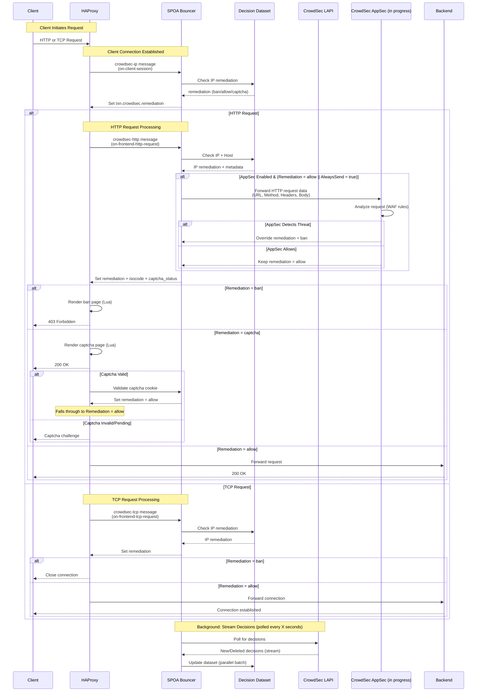

<div align="center">
  
</div>

# CrowdSec HAProxy SPOA Bouncer

[](https://golang.org/)
[](LICENSE)

A lightweight Stream Processing Offload Agent (SPOA) that contacts the CrowdSec Local API to fetch decisions in real time while aiming to be highly performant and minimize latency for clients. It manages an in-memory cache of bans and captchas, and directs HAProxy on how to treat each connection without blocking the data path.

## At a Glance

- **Real-time enforcement** – Streams decisions from CrowdSec via the Go bouncer SDK so ban/captcha/allow changes are visible within seconds.
- **HTTP and TCP coverage** – Handles the `crowdsec-ip`, `crowdsec-http`, and `crowdsec-tcp` SPOE messages to protect both web frontends and raw TCP services.
- **Host-aware responses** – Each host entry can customize ban pages, captcha providers, and logging while sharing the same SPOA worker.
- **Captcha challenges built in** – hCaptcha, reCAPTCHA, and Cloudflare Turnstile are supported with signed cookies so HAProxy can validate solved challenges on its own.
- **Memory-efficient dataset** – IPs live in a lock-free map and CIDRs are stored in a [BART](https://github.com/gaissmai/bart) radix tree, which keeps lookups in the tens of nanoseconds.
- **Optional GeoIP tagging** – Plug in MaxMind ASN/City databases to enrich decisions with ISO country codes for templating or ACLs.
- **Operational visibility** – Structured logging, Prometheus counters, and an optional pprof endpoint make it easy to monitor and debug the bouncer.
- **AppSec path under construction** – Hooks exist for forwarding HTTP payloads to CrowdSec AppSec, but the analysis step is not wired up yet.

## Architecture

The bouncer is a single binary with three key loops:

1. `go-cs-bouncer` maintains a long-lived stream to the CrowdSec Local API and feeds new/deleted decisions into the dataset (`pkg/dataset`).
2. The SPOA worker (`pkg/spoa`) listens on TCP and/or Unix sockets, answers HAProxy messages, and applies host-specific logic such as captchas or ban pages.
3. Auxiliary services (optional) expose Prometheus metrics and pprof diagnostics.

### Request Flow



**Flow highlights**
- The `crowdsec-ip` message runs first so every transaction carries an initial decision, even if HTTP parsing fails later.
- Host rules can override remediations (for instance, force captcha for specific domains) or decide whether captcha cookies should be issued/cleared.
- Captcha sessions live in the SPOA process; HAProxy only needs to copy cookies and template variables exposed via Lua.
- The AppSec branch above is a preview of the upcoming WAF integration – the code already parses HTTP payloads but does not yet call CrowdSec AppSec.

## Install & Run

The [official documentation](https://doc.crowdsec.net/u/bouncers/haproxy_spoa) covers packaging and upgrade notes. If you want to manually build, see the build section below. A quick happy path:

1. Install the package (Debian/RPM), use the provided Docker image, or build locally with `make build`.
2. Copy `config/crowdsec-spoa-bouncer.yaml` to `/etc/crowdsec/bouncers/` and set your CrowdSec LAPI URL and API key.
3. Wire the SPOE filter into HAProxy (see below) and copy the Lua helpers from `lua/` if you do not already ship them.
4. Start the service with `systemctl start crowdsec-haproxy-spoa-bouncer` or run `./crowdsec-spoa-bouncer -c /path/to/config.yaml` for local tests.

## Configure

### Service configuration

`config/crowdsec-spoa-bouncer.yaml` (plus `.yaml.local` overrides) controls the daemon:

```yaml
log_mode: file
log_dir: /var/log/crowdsec-spoa/
log_level: info

update_frequency: 10s
api_url: http://127.0.0.1:8080/
api_key: ${API_KEY}

listen_tcp: 0.0.0.0:9000
listen_unix: /run/crowdsec-spoa/spoa.sock

prometheus:
  enabled: true
  listen_addr: 127.0.0.1
  listen_port: 60601

pprof:
  enabled: false
  listen_addr: 127.0.0.1
  listen_port: 6060
```

Key pointers:
- You can run TCP, Unix, or both listeners; the SPOA worker will refuse to start if neither is set.
- `geo` settings accept MaxMind ASN/City paths and the watcher reloads files when they change.
- Prometheus/pprof servers stay disabled unless explicitly enabled, keeping production surfaces small by default.

### Host-level behavior

Hosts define how HAProxy should present bans or captchas. All hosts in the config file and in `hosts_dir` are loaded during startup.

```yaml
hosts:
  - host: "*.example.com"
    ban:
      contact_us_url: "mailto:security@example.com"
    captcha:
      provider: "hcaptcha"   # hcaptcha | recaptcha | turnstile
      site_key: "<public-key>"
      secret_key: "<private-key>"
      fallback_remediation: "ban"
      timeout: 5
    appsec:
      always_send: false      # reserved for upcoming AppSec support
```

If a captcha cannot be issued (missing host match, invalid provider, etc.), the SPOA automatically falls back to the configured remediation, so HAProxy always knows how to respond.

### HAProxy wiring

Add the SPOE filter and Lua helpers to your frontend. The config files in `config/` and the Lua scripts in `lua/` show complete examples; the snippet below highlights the essentials:

```haproxy
frontend www
    bind :80
    filter spoe engine crowdsec config /etc/haproxy/crowdsec.cfg

    http-request lua.crowdsec_handle if { var(txn.crowdsec.remediation) -m found }
    http-request lua.crowdsec_captcha if { var(txn.crowdsec.remediation) -m str "captcha" }
    http-request lua.crowdsec_ban if { var(txn.crowdsec.remediation) -m str "ban" }

    default_backend app
```

Use a dedicated SPOE section (`crowdsec.cfg`) to declare the messages you want HAProxy to send (`crowdsec-ip`, `crowdsec-http`, `crowdsec-tcp`) and which request variables should be exported; the provided sample covers the mandatory ones.

## Monitoring & Troubleshooting

- **Prometheus metrics** – Enable the metrics endpoint to scrape `crowdsec_haproxy_spoa_bouncer_active_decisions`, `crowdsec_haproxy_spoa_bouncer_processed_requests`, and `crowdsec_haproxy_spoa_bouncer_blocked_requests`. Scope/IP-type labels make it simple to track noisy sources.
- **Logging** – File or stdout logging is configurable; per-host log levels help when debugging only a subset of domains.
- **Profiling** – Switch on `pprof` in non-production environments to inspect CPU, heap, or goroutines via standard Go tooling.
- **Dataset inspection** – Use `log_level: trace` to watch BART operations and confirm that lists/ranges are loaded as expected.

## Development

Everything you need for local development is included in the repository:

```bash
git clone https://github.com/crowdsecurity/cs-haproxy-spoa-bouncer.git
cd cs-haproxy-spoa-bouncer
make build    # builds the binary in ./crowdsec-spoa-bouncer
make test     # runs Go tests, including dataset benchmarks
```

Docker Compose files under `docker/` and `docker-compose*.yaml` spin up HAProxy, the bouncer, and a CrowdSec LAPI for integration testing.

## Project Status & Roadmap

- AppSec request forwarding/parsing is in the tree, and enforcement is planned to land in 0.3.0.
- Performance optimizations (batching, decision compression) continue so high-volume HAProxy tiers can rely on a single SPOA worker.

## Contributing

Contributions are welcome—feel free to open an issue or PR:
1. Fork the repo and create a topic branch (`git checkout -b feature/my-change`).
2. Run `make test` (and any relevant integration checks) before submitting.
3. Open a PR with context about the problem you solved or the feature you added.

## License

MIT – see `LICENSE` for the full text.

## Acknowledgments

- [HAProxy](https://www.haproxy.org/) for the SPOE protocol and Lua flexibility.
- [BART](https://github.com/gaissmai/bart) for the radix tree implementation that backs range lookups.
