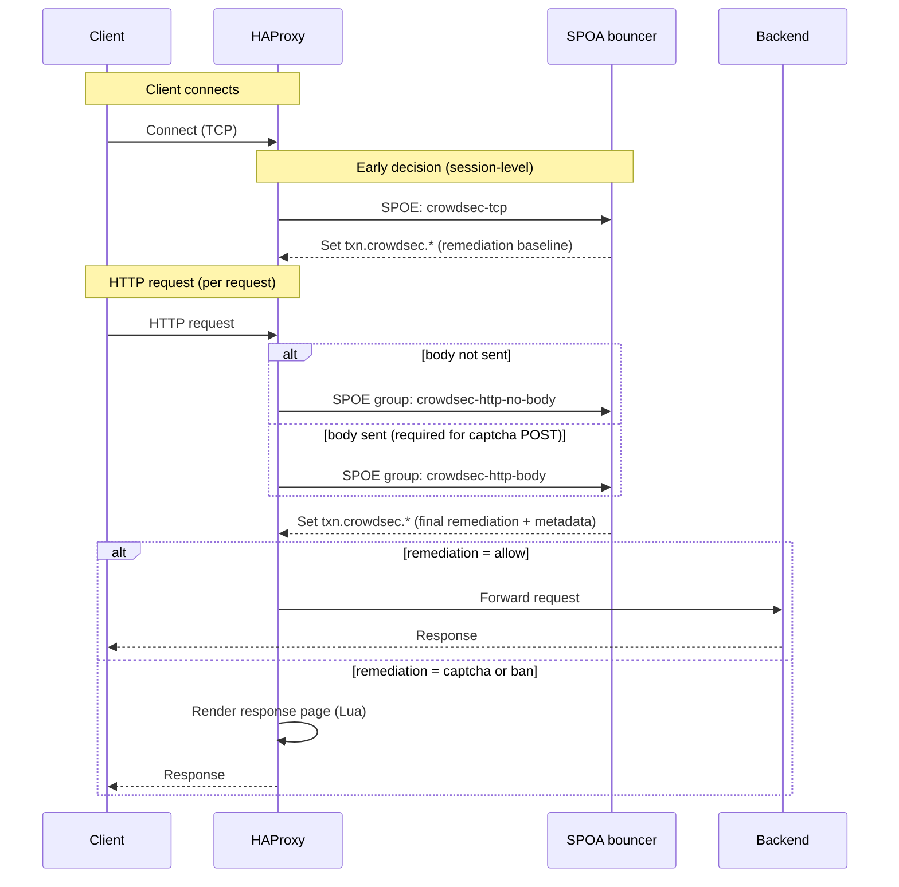

<div align="center">
  
</div>

# CrowdSec HAProxy SPOA Bouncer

[](https://golang.org/)
[](LICENSE)

A lightweight Stream Processing Offload Agent (SPOA) that contacts the CrowdSec Local API to fetch decisions in real time while aiming to be highly performant and minimize latency for clients. It manages an in-memory cache of bans and captchas, and directs HAProxy on how to treat each connection without blocking the data path.

## At a Glance

- **Real-time enforcement** – Streams decisions from CrowdSec via the Go bouncer SDK so ban/captcha/allow changes are visible within seconds.
- **HTTP and TCP coverage** – Supports early IP checks via `crowdsec-tcp` and HTTP inspection via `crowdsec-http-body` / `crowdsec-http-no-body` to protect both web frontends and raw TCP services.
- **Host-aware responses** – Each host entry can customize ban pages, captcha providers, and logging while sharing the same SPOA worker.
- **Captcha challenges built in** – hCaptcha, reCAPTCHA, and Cloudflare Turnstile are supported with signed, stateless cookies so solved challenges can be verified without round-tripping to the provider.
- **Memory-efficient dataset** – IPs live in a lock-free map and CIDRs are stored in a [BART](https://github.com/gaissmai/bart) radix tree, which keeps lookups in the tens of nanoseconds.
- **Optional GeoIP tagging** – Plug in MaxMind ASN/City databases to enrich decisions with ISO country codes for templating or ACLs.
- **Operational visibility** – Structured logging, Prometheus counters, and an optional pprof endpoint make it easy to monitor and debug the bouncer.
- **Optional AppSec validation** – When enabled, forwards HTTP request data to CrowdSec AppSec and can escalate a request to a ban.

## Architecture

The bouncer is a single binary with three key loops:

1. `go-cs-bouncer` maintains a long-lived stream to the CrowdSec Local API and feeds new/deleted decisions into the dataset (`pkg/dataset`).
2. The SPOA worker (`pkg/spoa`) listens on TCP and/or Unix sockets, answers HAProxy messages, and applies host-specific logic such as captchas or ban pages.
3. Auxiliary services (optional) expose Prometheus metrics and pprof diagnostics.

### Request Flow (Overview)

More detailed request/decision flow diagrams are in [`ARCHITECTURE.md`](ARCHITECTURE.md).



## Install & Run

The [official documentation](https://doc.crowdsec.net/u/bouncers/haproxy_spoa) covers packaging and upgrade notes. If you want to manually build, see the build section below. A quick happy path:

1. Install the package (Debian/RPM), use the provided Docker image, or build locally with `make build`.
2. Copy [`config/crowdsec-spoa-bouncer.yaml`](config/crowdsec-spoa-bouncer.yaml) to `/etc/crowdsec/bouncers/` and set your CrowdSec LAPI URL and API key.
3. Wire the SPOE filter into HAProxy (see below) and copy the Lua helpers from [`lua/`](lua/) if you do not already ship them.
4. Start the service with `systemctl start crowdsec-haproxy-spoa-bouncer` or run `./crowdsec-spoa-bouncer -c /path/to/config.yaml` for local tests.

## Configure

Configuration is YAML. Start from the example in [`config/crowdsec-spoa-bouncer.yaml`](config/crowdsec-spoa-bouncer.yaml) and override locally with `.yaml.local`.

The bouncer supports:
- LAPI decision streaming and an in-memory dataset
- TCP and/or Unix socket listeners for HAProxy SPOE
- Optional per-host policy (ban page templating, captcha providers, logging)
- Optional GeoIP enrichment, Prometheus metrics, pprof, and AppSec validation

Detailed configuration guides:
- Hosts and match priority: [`pkg/host/README.md`](pkg/host/README.md)
- Captcha providers and configuration: [`pkg/captcha/README.md`](pkg/captcha/README.md)
- Ban page templating values: [`internal/remediation/ban/README.md`](internal/remediation/ban/README.md)
- Architecture and request flow: [`ARCHITECTURE.md`](ARCHITECTURE.md)

### HAProxy wiring

Add the SPOE filter and Lua helpers to your frontend. The config files in `config/` and the Lua scripts in `lua/` show complete examples; the snippet below highlights the essentials:

```haproxy
frontend www
    bind :80
    unique-id-format %[uuid()]
    unique-id-header X-Unique-ID
    filter spoe engine crowdsec config /etc/haproxy/crowdsec.cfg

    acl body_within_limit req.body_size -m int le 51200
    http-request send-spoe-group crowdsec crowdsec-http-body if body_within_limit || !{ req.body_size -m found }
    http-request send-spoe-group crowdsec crowdsec-http-no-body if !body_within_limit { req.body_size -m found }

    http-request redirect code 302 location %[url] if { var(txn.crowdsec.remediation) -m str "allow" } { var(txn.crowdsec.redirect) -m found }

    http-request lua.crowdsec_handle if { var(txn.crowdsec.remediation) -m str "captcha" }
    http-request lua.crowdsec_handle if { var(txn.crowdsec.remediation) -m str "ban" }

    http-after-response set-header Set-Cookie %[var(txn.crowdsec.captcha_cookie)] if { var(txn.crowdsec.captcha_status) -m found } { var(txn.crowdsec.captcha_cookie) -m found }
    http-after-response set-header Set-Cookie %[var(txn.crowdsec.captcha_cookie)] if { var(txn.crowdsec.captcha_cookie) -m found } !{ var(txn.crowdsec.captcha_status) -m found }

    default_backend app
```

Use a dedicated SPOE section (`crowdsec.cfg`) to declare the messages HAProxy sends and which request variables are exported. The provided sample uses:
- `crowdsec-tcp` (event `on-client-session`) for early, connection-level IP decisions
- `crowdsec-http-body` / `crowdsec-http-no-body` (sent via SPOE groups with the same names) for per-request HTTP inspection, with conditional body forwarding

Important: captcha validation needs the request body (form-encoded POST). Ensure your frontend sends captcha submissions via the `crowdsec-http-body` group (see `http-request send-spoe-group ... crowdsec-http-body` in the examples).

For complete, working examples (including optional request-body forwarding, captcha redirects, and cookie management), see [`config/haproxy.cfg`](config/haproxy.cfg) and [`config/crowdsec.cfg`](config/crowdsec.cfg).

## Monitoring & Troubleshooting

- **Prometheus metrics** – Enable the metrics endpoint to scrape bouncer and decision counters.
- **Logging** – File or stdout logging is configurable; per-host log levels help when debugging only a subset of domains.
- **Profiling** – Switch on `pprof` in non-production environments to inspect CPU, heap, or goroutines via standard Go tooling.
- **Dataset inspection** – Use `log_level: trace` to watch BART operations and confirm that lists/ranges are loaded as expected.

## Development

Everything you need for local development is included in the repository:

```bash
git clone https://github.com/crowdsecurity/cs-haproxy-spoa-bouncer.git
cd cs-haproxy-spoa-bouncer
make build    # builds the binary in ./crowdsec-spoa-bouncer
make test     # runs Go tests
```

Docker Compose files under `docker/` and `docker-compose*.yaml` spin up HAProxy, the bouncer, and a CrowdSec LAPI for integration testing.

## Project Status & Roadmap

- AppSec validation is available for HTTP flows when configured; feedback on coverage and performance is welcome.
- Performance optimizations (batching, decision compression) continue so high-volume HAProxy tiers can rely on a single SPOA worker.

## Contributing

Contributions are welcome—feel free to open an issue or PR:
1. Fork the repo and create a topic branch (`git checkout -b feature/my-change`).
2. Run `make test` (and any relevant integration checks) before submitting.
3. Open a PR with context about the problem you solved or the feature you added.

## License

MIT – see `LICENSE` for the full text.

## Acknowledgments

- [HAProxy](https://www.haproxy.org/) for the SPOE protocol and Lua flexibility.
- [BART](https://github.com/gaissmai/bart) for the radix tree implementation that backs range lookups.
