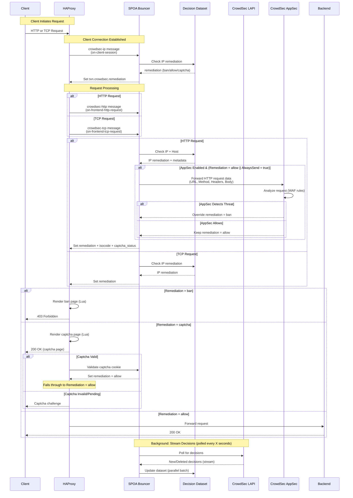

# CrowdSec HAProxy SPOA Bouncer

[](https://golang.org/)
[](LICENSE)

A high-performance [HAProxy SPOE](https://www.haproxy.com/blog/extending-haproxy-with-the-stream-processing-offload-engine) (Stream Processing Offload Engine) filter for [CrowdSec](https://www.crowdsec.net/) that provides real-time IP reputation checking, WAF capabilities, and AppSec protection for your HAProxy infrastructure.

## 🚀 Features

- **⚡ High Performance**: Lock-free reads with atomic pointers for zero-blocking SPOA handlers
- **💾 Memory Efficient**: Hybrid storage system using `sync.Map` for individual IPs and [BART](https://github.com/gaissmai/bart) (Binary Adaptive Radix Tree) for CIDR ranges
- **🔄 Real-time Updates**: Streams decisions from CrowdSec Local API with parallel batch processing
- **🛡️ Multiple Remediations**: Supports ban, captcha, and allow decisions with host-based customization
- **🌍 GeoIP Support**: Optional GeoIP2 database integration for country-based blocking
- **📊 Prometheus Metrics**: Built-in metrics for monitoring active decisions, processed requests, and blocked requests
- **🔒 AppSec Integration**: Web Application Firewall (WAF) capabilities for advanced threat detection

## 📖 How It Works

The CrowdSec HAProxy SPOA Bouncer integrates seamlessly with HAProxy using the SPOE protocol. Here's how requests flow through the system:



### Request Flow Details

1. **Client Connection** (`on-client-session` event):
   - HAProxy sends `crowdsec-ip` message with client IP address
   - SPOA checks IP against the decision dataset
   - Sets `txn.crowdsec.remediation` variable (ban/allow/captcha)

2. **HTTP Request** (`on-frontend-http-request` event):
   - HAProxy sends `crowdsec-http` message with full HTTP request details
   - SPOA performs additional checks:
     - Host-based remediation customization
     - Captcha cookie validation
   - If AppSec is enabled and (remediation = allow OR AlwaysSend = true):
     - SPOA forwards HTTP request data (URL, method, headers, body) to CrowdSec AppSec
     - AppSec analyzes the request using WAF rules
     - AppSec can override remediation to ban if threats are detected
   - Sets additional variables: `isocode`, `captcha_status`, `redirect`

3. **Remediation Handling**:
   - **Ban**: HAProxy renders ban page via Lua script, returns 403
   - **Captcha**: HAProxy renders captcha page, validates cookie on subsequent requests
   - **Allow**: Request proceeds to backend server

4. **Background Updates**:
   - SPOA continuously streams decisions from CrowdSec Local API
   - Updates are processed in parallel batches for optimal performance
   - Dataset uses copy-on-write for lock-free reads during updates

## 🏗️ Architecture

### Memory-Efficient Hybrid Storage

The bouncer uses a hybrid storage approach optimized for real-world workloads:

- **Individual IPs**: Stored in `sync.Map` with atomic pointers for O(1) lookups
- **CIDR Ranges**: Stored in [BART](https://github.com/gaissmai/bart) (Binary Adaptive Radix Tree) for efficient longest prefix match
- **Copy-on-Write**: All updates use copy-on-write pattern ensuring readers never block
- **Parallel Processing**: Add/Remove operations use `sync.WaitGroup.Go()` for concurrent batch processing

### Performance Characteristics

- **IPMap lookup**: ~72 ns/op, 0 allocations
- **RangeSet lookup**: ~69 ns/op, 0 allocations
- **Memory usage**: ~70MB for 163K+ active decisions
- **Zero blocking**: SPOA handlers never block, even during dataset updates

## 📦 Installation

See the [official documentation](https://doc.crowdsec.net/u/bouncers/haproxy_spoa) for detailed installation instructions.

### Quick Start

```bash
# Install from package repository
# (See documentation for your distribution)

# Configure HAProxy
# Copy example configs from config/ directory

# Start the bouncer
systemctl start crowdsec-haproxy-spoa-bouncer
```

## ⚙️ Configuration

### HAProxy Configuration

Add the SPOE filter to your HAProxy frontend:

```haproxy
frontend www
    bind *:80
    filter spoe engine crowdsec config /etc/haproxy/crowdsec.cfg
    
    # Handle remediations
    http-request lua.crowdsec_handle if { var(txn.crowdsec.remediation) -m str "captcha" }
    http-request lua.crowdsec_handle if { var(txn.crowdsec.remediation) -m str "ban" }
    
    use_backend api_servers
```

### SPOA Configuration

Configure the bouncer in `/etc/crowdsec/haproxy-spoa-bouncer.yaml`:

```yaml
crowdsec_lapi_url: http://localhost:8080
crowdsec_lapi_key: YOUR_API_KEY
crowdsec_update_frequency: 10s
listen_addr: 0.0.0.0
listen_port: 9000
log_level: info
```

See `config/crowdsec-spoa-bouncer.yaml` for all available options.

## 📊 Monitoring

The bouncer exposes Prometheus metrics on port `9998` (configurable):

- `crowdsec_haproxy_spoa_bouncer_active_decisions`: Active decisions by origin, IP type, and scope
- `crowdsec_haproxy_spoa_bouncer_processed_requests`: Total processed requests by IP type
- `crowdsec_haproxy_spoa_bouncer_blocked_requests`: Blocked requests by origin, IP type, and remediation

### Example Prometheus Query

```promql
# Total active decisions
sum(crowdsec_haproxy_spoa_bouncer_active_decisions)

# Block rate
rate(crowdsec_haproxy_spoa_bouncer_blocked_requests[5m]) / 
rate(crowdsec_haproxy_spoa_bouncer_processed_requests[5m])
```

## 🔧 Development

### Building from Source

```bash
git clone https://github.com/crowdsecurity/cs-haproxy-spoa-bouncer.git
cd cs-haproxy-spoa-bouncer
make build
```

### Running Tests

```bash
make test
```

### Profiling

The bouncer exposes pprof endpoints on port `9999` (configurable):

```bash
# Heap profile
go tool pprof http://localhost:9999/debug/pprof/heap

# CPU profile
go tool pprof http://localhost:9999/debug/pprof/profile
```

## 📚 Documentation

- [Official Documentation](https://doc.crowdsec.net/u/bouncers/haproxy_spoa)
- [HAProxy SPOE Documentation](https://www.haproxy.com/documentation/hapee/latest/configuration/spoe/)
- [CrowdSec Documentation](https://doc.crowdsec.net/)

## 🗺️ Roadmap

This outlines the goals of the project, and the current status of each.

### In Progress
- **AppSec Integration**: WAF capabilities for advanced threat detection

### Future Enhancements
- Enhanced GeoIP support
- Additional remediation types
- Performance optimizations

## 🤝 Contributing

Contributions are welcome! Please feel free to submit a Pull Request.

1. Fork the repository
2. Create your feature branch (`git checkout -b feature/amazing-feature`)
3. Commit your changes (`git commit -S -m 'Add some amazing feature'`)
4. Push to the branch (`git push origin feature/amazing-feature`)
5. Open a Pull Request

## 📄 License

This project is licensed under the MIT License - see the [LICENSE](LICENSE) file for details.

## 🙏 Acknowledgments

- [HAProxy](https://www.haproxy.org/) for the powerful load balancer and SPOE protocol
- [BART](https://github.com/gaissmai/bart) for the efficient radix tree implementation
